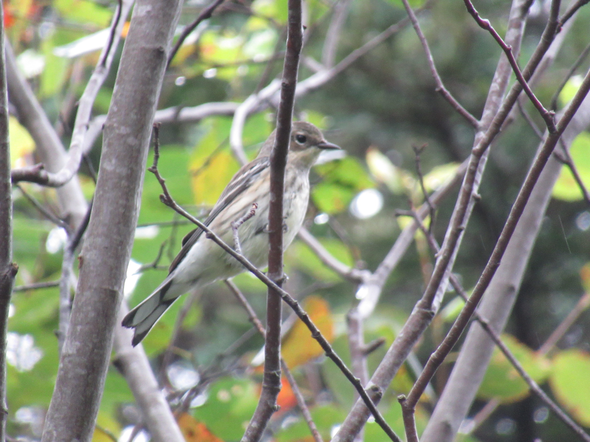
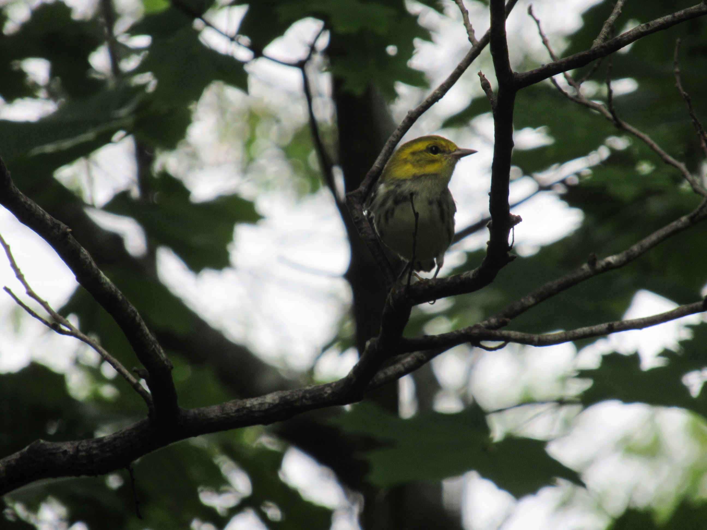

A common misconception, which I share (until reminded by brute fact) is that August is too early for bird migration. Apart from shorebirds, which crazily start in July, southward movements don't really get rolling until September.

But (and here's the brute fact) here's a Palm Warbler I saw in my patch today. It was one of my yearly reminders that I should get looking for fall migrants way earlier in August than my instincts tell me. Sure, it's possible that some of the birds I see are locally raised youngsters, like this yellow-rumped

or this black-throated green:

But really, it's pretty unlikely that Nashville Warbler (which I didn't get a picture of) and Palm Warbler would nest successfully in Point Pleasant Park.
