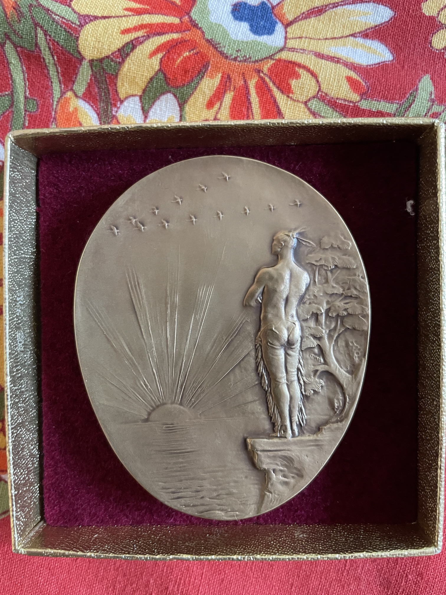

I've finally got a chance to have a close look at the Brewster medal (long story) and noticed the oddest thing.

First, for those who don't know, the medal is awarded  for recent contributions to ornithology. It's named after William Brewster, hero of my childhood because he wrote *Birds of the Cambridge Region*. I pored through that book again and again, especially the maps, to figure out where there might be remnants of fields with bluebirds (where my grade school was), forests with pewees (the now-small, but still shady, Norton Woods), and pine groves with Passenger Pigeons (near Fresh Pond Mall).

William Brewster also started the Nuttall Ornithological Club, predecessor of the American Ornithologists Union, now part of the North American Ornithological Council, which now awards the award. There's plenty more to say about him and his writings, which I'll save for later (apart from recommending *October Farm* as a fun read for any birder from New England).

What's odd about the medal, though, is not the side view of Brewster's head, which is what's usually pictured when people talk about it, but what's on the reverse. Have a look:

Now is it just me, or does that feel wrong in all sorts of ways? What, I wonder, was this image meant to convey - in general, but also specifically in relevance to ornithology? I tried googling a bit, and all I could find was a description of it by Margaret Morse Nice, which mentioned the flock of geese that I hadn't noticed at first, having been distracted by the scene's other distracting features.

If anyone knows, you can leave your comment in the comments box. Oh wait, there's no comments box. I guess I'll have to get back to google one day and dig up the answer, perhaps buried in the Annals of the Nuttall Ornithological Club.
