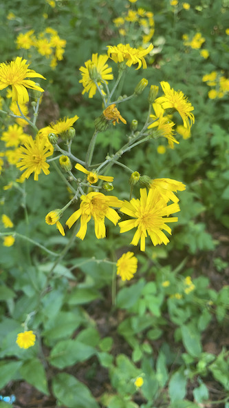

A random weed, growing from crevices on the Tower Road bridge across the railroad tracks, but then it's everywhere. And because I keep mixing up all the plants that look like that, for instance hawkweed:

Why would I feature it? Because I've always wondered about its milky sap. I see from the trusted internet that its milkiness is why the plant was fed to lactating sows, and thus the name. But I wasn't satisfied with that answer (being a seeker of the Truth and all).

I still don't have an answer, perhaps because I have the wrong question: why do sow thistles, milkweed, dandelions, etc etc all have milky sap?  Perhaps there's no answer, because they're each there for a different reason.

But they have at least some aspects in common, besides that they're white. For instance, I read that sow thistle latex was used as chewing gum, like milkweed was. Then again, I also read that it's used to cure warts, which is a new one on me.

So maybe it's a question for you readers out there. Why do all those plants have a milky sap? Oh yeah, you can't answer because I didn't code comments into this. And I haven't made this blog public anyway.

Oh well, I'll just have to keep Seeking.

