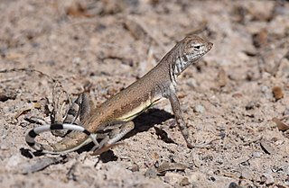

Today, we're going to talk about the main methods that behavioral  ecologists use to study the behaviors that we're talking about in this course. 

## The logic of adaptation

Remember, we've talked about the beetle in that cartoon example of evolution by natural selection that I gave in the previous lecture.  And what we were saying was that at the end of this process of evolution by natural selection,  the beetles were spotless in order to avoid predation, not something the beetles were thinking.  But, you know, that was the end result of this kind of thing.  So the response was to avoid predation because:

1) spotlessness reduced predation;

2) this increased their fitness - in other words, their reproduction and their survival and reproductive success (there's lots of definitions of fitness that we don't get into in this course, but that's roughly what it is);  

3) that means that spotlessness thus evolves in that environment because it's "favoured"  by natural selection (it's not like natural selection is picking it out in any sense - just a process kind of like a kid at the beach sifting sand through one of those little sieves and sorting out the cigarette butts or or whatever; a very passive process, but results in these amazing adaptations that we talk about in this course). 

So how does a behavioral ecologist study these sorts of behavioral adaptations?  Well, think of the logic that goes behind this beetle example that I've given youA a behavior is an adaptation, if its **design** has effects (again, I don't mean somebody up there, you know, deciding how the beetles should be, but just the intricate way in which the beetle ends up because of this process of evolution by natural selection) that **increase fitness**, and, because of that (because of those five easy steps of natural selection), it's evolved through evolution by natural selection - i.e., **it's been selected for in that environment**.

So those are the main methods of behavioral ecology that just follow that kind of logic. 

1) The method of optimal design.  We use optimality models and so on for this, which we'll talk about more detail later, but we're simply asking, is the behavior well-designed for its job? 
2) Correlate behaviors with fitness.
3) The comparative method: correlate behavior across taxa to see whether the  differences in behavior are correlated with differences in the environment,  in the ecology, of these organisms.

##1. Optimal design

So first of all, let's go through optimal design.  We come up with hypotheses and predictions about how behavior should be.  If it's got to do a particular job and/or we might look at a behavior and say, what is this behavior doing?  What what's the functional explanation for this behavior?  And so I should say a little bit about hypotheses and predictions,  because this is something that's pretty important in behavioral ecology, but also it's something that you do in your behavior journals;  you're going to come up with see your own behaviors and come up with hypotheses and predictions. 

###Hypotheses and predictions

So a hypothesis is a proposed it's a candidate explanation about -- in the case of behavioral ecology -- about the function of a behavior.  It could be about other things, too.  But for behavioral ecologists, it would be about the function of the behavior -- what kind of job it does for the animal.  The predictions are what you should be able to observe, what you should be able to actually see or measure or whatever.  If the hypothesis is correct, in other words, if your explanation for the behavior is the right explanation and good predictions should be **logical**.  In other words, they should follow from the hypothesis. They should be **testable**; in other words, they should be things that you should be able to see or measure in some way, detect in some way.  And they should also be, for want of a better word,  I don't know exactly the word to use for this, but there should be **exclusive** as best as you can get. 

By exclusive, I mean that they should kind of rule out other hypotheses.  That can be a tricky thing to do. Sometimes it helps to set up alternative hypotheses -  different explanations: if this one's true, then you'd expect this prediction,  and if this one's true, you'd expect that other prediction. That helps you separate hypotheses, so, ideally, that's what you want in your predictions. But it's not always perfectly possible. 

So let me show you an example of this about a basic approach to this question of optimal design.  What what job does a behavior do? What's its function?  You see a behavior and how does its design lead to particular effects, specifically adaptive effects?  In other words, things that are going to increase the fitness of the animal and therefore be selected for through evolution by natural selection.

<h3>Why do zebra-tailed lizards wag their tail?</h3>
  So here's the example. Here's a zebra-tailed lizard.  And look at how they wave their tail. And they wave their tail more when there's a predator around.  They don't do it all that much.  When they're sort of doing mating displays or territorial displays like these ones who are just doing for that, they sort of bob their heads.
   
  
    Undergraduate students in another behavioral ecology course came up  with various hypotheses about why these zebra-tailed lizards wag their tail. They knew that lizards  did it when there was a potential predator around, for instance, a human that was walking toward them,  just like you might see pigeons getting "nervous" when you're walking toward them.
  They were in an Arizona university, so these zebra tailed lizards were all over the campus. The students came up with  hypotheses and predictions they could test right on campus:
  1. Wagging gets the predator to attack the tail, attack the tail (and, like many lizards and salamanders, if the predator grabs the tail, the tail can drop off; the lizard can grow a new one).
  2. Waggings warn other lizards that there's a predator around.
  3. Wagging signals to the predator that the lizard can escape.
  That last one sounds kind of weird, but in a nutshell, and we'll talk about this more in the future lecture.  If the lizard can signal to the predator that it can escape, then that can be to the predator's advantage, because the predator avoids wasting time chasing a lizard that it can't catch anyway.
  How did the students test these different hypotheses?  So the first one: "gets predator to attack the tail". You would expect the tail wagging to be more likely if the attack was imminent.  So just before the predator grabs it, that's when you wag your tail.  So they tested this by throwing a stick at the lizard versus walking slowly toward the lizard.  They expected that if you're walking slowly towards the lizard,  then that's plenty of time for the lizard to run off, whereas if you throw a stick, immediately,  There's the stick and the lizard goes like, something's about to grab me, and it should wag their tail if that's what the tail wagging is about.  Another possibility is that it warns other lizards.  And of course, you would only expect them to tail wag when there's other lizards around to receive that signal.  A third possibility is that they wag more. A wag is more likely if they're near cover or if they're warm.  And that's because if they're near cover like a rock or something, they can hide underneath.  They're more likely to escape. And if they're warm and because they're reptiles, their metabolism's going better and they can run faster.  And so they're more likely to escape that. So they should wag when they're more likely to escape.  if this hypothesis holds, and the wag should be less likely if the attack is sudden.  So, for instance, if you're throwing a stick at the lizard, then the attack should be less likely.  And what's nice about that prediction is that it it it ticks that box of exclusivity, which I was talking about before.  Right? If if it goes one way, it's this hypothesis. If it goes the other way, it's another hypothesis.  Short story is these hypotheses didn't work out and these hypotheses did work out because these  students could manage to test these hypotheses by walking toward lizards and throwing sticks at them.  So it's a great idea. A great example of hypotheses and predictions that you can do on your own. 

Tooltip text

Here's the  mousove text.r

Clicking this number[^fn-sample_footnote]

[^fn-sample_footnote]: Handy! Now click the return link to go back.

And we encourage you to think about these things through the course.  And that's part of the point of the of the behavior journal that you'll be keeping through this course.  OK. Now, there's two approaches to this idea of optimal design.  One thing is what we've been talking about already. You see the behavior and then you ask, what's it for?  And we're going to be doing more of this exercise in our Thursday,  Atlantic Time meeting this week.  And also, you'll be doing more of it in your behavior journals. But most behavior ecology kind of goes the other way where we recognize there's  ecological or social problem that the that the animal must solve.  And we ask what behavior is best for that. It's kind of going the other way.  It's one of our main tools for this is optimality models.  And we'll be talking about that. It's a it's a huge topic. And we'll be talking about it next week. 

